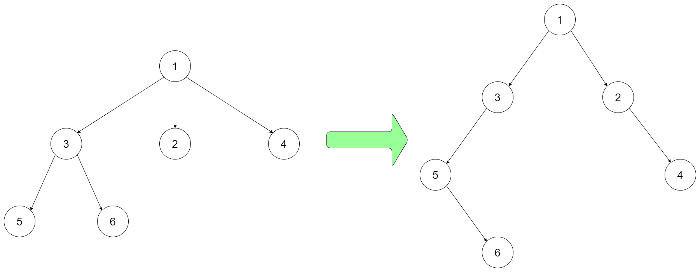
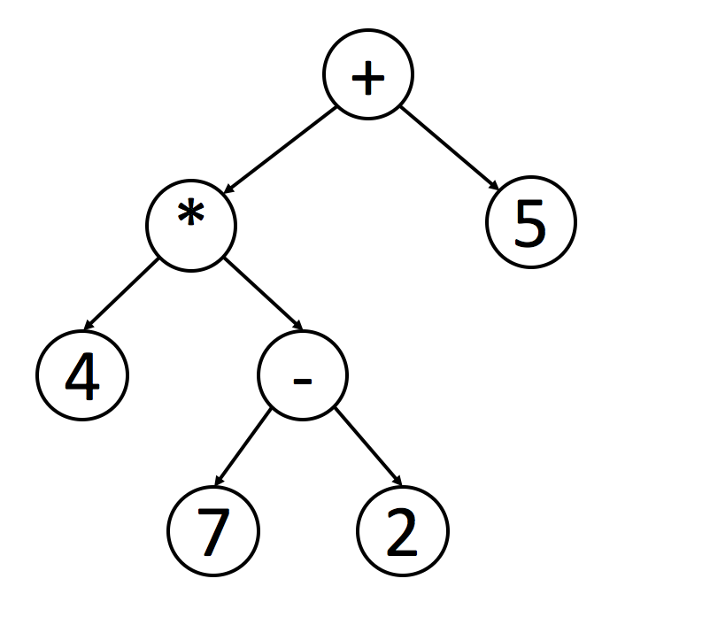

### Q1 [Leetcode 559] [Maximum Depth of N-ary Tree](https://leetcode.com/problems/maximum-depth-of-n-ary-tree)
Given a n-ary tree, find its maximum depth.

The maximum depth is the number of nodes along the longest path from the root node down to the farthest leaf node.

For example, given a 3-ary tree:


We should return its max depth, which is 3.

Note:

* The depth of the tree is at most 1000.
* The total number of nodes is at most 5000.

### Q2 [Leetcode 431] [Encode N-ary Tree to Binary Tree](https://leetcode.com/problems/encode-n-ary-tree-to-binary-tree)

Design an algorithm to encode an N-ary tree into a binary tree and decode the binary tree to get the original N-ary tree. An N-ary tree is a rooted tree in which each node has no more than N children. Similarly, a binary tree is a rooted tree in which each node has no more than 2 children. There is no restriction on how your encode/decode algorithm should work. You just need to ensure that an N-ary tree can be encoded to a binary tree and this binary tree can be decoded to the original N-nary tree structure.

For example, you may encode the following 3-ary tree to a binary tree in this way:




Note that the above is just an example which might or might not work. You do not necessarily need to follow this format, so please be creative and come up with different approaches yourself.


Note:
* N is in the range of [1, 1000]
* Do not use class member/global/static variables to store states. Your encode and decode algorithms should be stateless.

### Q3 [Leetcode 428] [Serialize and Deserialize N-ary Tree](https://leetcode.com/problems/serialize-and-deserialize-n-ary-tree)

Serialization is the process of converting a data structure or object into a sequence of bits so that it can be stored in a file or memory buffer, or transmitted across a network connection link to be reconstructed later in the same or another computer environment.

Design an algorithm to serialize and deserialize an N-ary tree. An N-ary tree is a rooted tree in which each node has no more than N children. There is no restriction on how your serialization/deserialization algorithm should work. You just need to ensure that an N-ary tree can be serialized to a string and this string can be deserialized to the original tree structure.

For example, you may serialize the following 3-ary tree


as [1 [3[5 6] 2 4]]. You do not necessarily need to follow this format, so please be creative and come up with different approaches yourself.


Note:

* N is in the range of [1, 1000]
* Do not use class member/global/static variables to store states. Your serialize and deserialize algorithms should be stateless.

## LeetCode Binary Tree [1/1] (Aug 28)
A tree is a frequently-used data structure to simulate a hierarchical tree structure.

Each node of the tree will have a root value and a list of references to other nodes which are called child nodes. From graph view, a tree can also be defined as a directed acyclic graph which has N nodes and N-1 edges.

A Binary Tree is one of the most typical tree structure. As the name suggests, a binary tree is a tree data structure in which each node has at most two children, which are referred to as the left child and the right child.

### Traverse a Tree - Introduction

* Pre-order traversal is to visit the root first. Then traverse the left subtree. Finally, traverse the right subtree.
* In-order traversal is to traverse the left subtree first. Then visit the root. Finally, traverse the right subtree.
* Post-order traversal is to traverse the left subtree first. Then traverse the right subtree. Finally, visit the root.

It is worth noting that when you delete nodes in a tree, deletion process will be in post-order. That is to say, when you delete a node, you will delete its left child and its right child before you delete the node itself.

Also, post-order is widely use in mathematical expression. It is easier to write a program to parse a post-order expression. Here is an example:



You can easily figure out the original expression using the inorder traversal. However, it is not easy for a program to handle this expression since you have to check the priorities of operations.

If you handle this tree in postorder, you can easily handle the expression using a stack. Each time when you meet a operator, you can just pop 2 elements from the stack, calculate the result and push the result back into the stack.

### Q4 [Leetcode 144] [Binary Tree Preorder Traversal](https://leetcode.com/problems/binary-tree-preorder-traversal)

Given a binary tree, return the preorder traversal of its nodes' values.

Example:
```
Input: [1,null,2,3]
   1
    \
     2
    /
   3

Output: [1,2,3]
```
Follow up: Recursive solution is trivial, could you do it iteratively?

### Q5 [Leetcode 145] [Binary Tree Postorder Traversal](https://leetcode.com/problems/binary-tree-postorder-traversal)
Given a binary tree, return the postorder traversal of its nodes' values.

Example:
```
Input: [1,null,2,3]
   1
    \
     2
    /
   3

Output: [3,2,1]
```
Follow up: Recursive solution is trivial, could you do it iteratively?

###  Level-order Traversal - Introduction
Level-order traversal is to traverse the tree level by level.

Breadth-First Search is an algorithm to traverse or search in data structures like a tree or a graph. The algorithm starts with a root node and visit the node itself first. Then traverse its neighbors, traverse its second level neighbors, traverse its third level neighbors, so on and so forth.

When we do breadth-first search in a tree, the order of the nodes we visited is in level order.

### Q6 [Leetcode 102] [Binary Tree Level Order Traversal](https://leetcode.com/problems/binary-tree-level-order-traversal)
Given a binary tree, return the level order traversal of its nodes' values. (ie, from left to right, level by level).

For example:
```
Given binary tree [3,9,20,null,null,15,7],
    3
   / \
  9  20
    /  \
   15   7
```
return its level order traversal as:
```
[
  [3],
  [9,20],
  [15,7]
]
```

### Solve Tree Problems Recursively
In previous sections, we have introduced how to solve tree traversal problem recursively. Recursion is one of the most powerful and frequent used methods for solving tree related problems.

As we know, a tree can be defined recursively as a node(the root node), which includes a value and a list of references to other nodes. Recursion is one of the nature features of a tree. Therefore, many tree problems can be solved recursively. For each recursion level, we can only focus on the problem within one single node and call the function recursively to solve its children.

Typically, we can solve a tree problem recursively from the top down or from the bottom up.

### "Top-down" Solution
"Top-down" means that in each recursion level, we will visit the node first to come up with some values, and pass these values to its children when calling the function recursively. So the "top-down" solution can be considered as kind of preorder traversal. To be specific, the recursion function top_down(root, params) works like this:
```
1. return specific value for null node
2. update the answer if needed                      // anwer <-- params
3. left_ans = top_down(root.left, left_params)      // left_params <-- root.val, params
4. right_ans = top_down(root.right, right_params)   // right_params <-- root.val, params
5. return the answer if needed                      // answer <-- left_ans, right_ans
```
For instance, consider this problem: given a binary tree, find its maximum depth.

We know that the depth of the root node is 1. For each node, if we know the depth of the node, we will know the depth of its children. Therefore, if we pass the depth of the node as a parameter when calling the function recursively, all the nodes know the depth of themselves. And for leaf nodes, we can use the depth to update the final answer. Here is the pseudocode for the recursion function maximum_depth(root, depth):
```
1. return if root is null
2. if root is a leaf node:
3.      answer = max(answer, depth)         // update the answer if needed
4. maximum_depth(root.left, depth + 1)      // call the function recursively for left child
5. maximum_depth(root.right, depth + 1)     // call the function recursively for right child
```

### "Bottom-up" Solution
"Bottom-up" is another recursion solution. In each recursion level, we will firstly call the functions recursively for all the children nodes and then come up with the answer according to the return values and the value of the root node itself. This process can be regarded as kind of postorder traversal. Typically, a "bottom-up" recursion function bottom_up(root) will be like this:
```
1. return specific value for null node
2. left_ans = bottom_up(root.left)          // call function recursively for left child
3. right_ans = bottom_up(root.right)        // call function recursively for right child
4. return answers                           // answer <-- left_ans, right_ans, root.val
```

Let's go on discussing the question about maximum depth but using a different way of thinking: for a single node of the tree, what will be the maximum depth x of the subtree rooted at itself?

If we know the maximum depth l of the subtree rooted at its left child and the maximum depth r of the subtree rooted at its right child, can we answer the previous question? Of course yes, we can choose the maximum between them and plus 1 to get the maximum depth of the subtree rooted at the selected node. That is x = max(l, r) + 1.

It means that for each node, we can get the answer after solving the problem of its children. Therefore, we can solve this problem using a "bottom-up" solution. Here is the pseudocode for the recursion function maximum_depth(root):
```
1. return 0 if root is null                 // return 0 for null node
2. left_depth = maximum_depth(root.left)
3. right_depth = maximum_depth(root.right)
4. return max(left_depth, right_depth) + 1  // return depth of the subtree rooted at root
```

### Q7 [Leetcode 104] [Maximum Depth of Binary Tree](https://leetcode.com/problems/maximum-depth-of-binary-tree)

Given a binary tree, find its maximum depth.

The maximum depth is the number of nodes along the longest path from the root node down to the farthest leaf node.

Note: A leaf is a node with no children.

Example:

Given binary tree [3,9,20,null,null,15,7],
```
    3
   / \
  9  20
    /  \
   15   7
```
return its depth = 3.

### Q8 [Leetcode 101] [Symmetric Tree](https://leetcode.com/problems/symmetric-tree)
Given a binary tree, check whether it is a mirror of itself (ie, symmetric around its center).

For example, this binary tree [1,2,2,3,4,4,3] is symmetric:
```
    1
   / \
  2   2
 / \ / \
3  4 4  3
```
But the following [1,2,2,null,3,null,3] is not:
```
    1
   / \
  2   2
   \   \
   3    3
```
Note:
Bonus points if you could solve it both recursively and iteratively.

### Q9 [Leetcode 112] [Path Sum](https://leetcode.com/problems/path-sum)
Given a binary tree and a sum, determine if the tree has a root-to-leaf path such that adding up all the values along the path equals the given sum.

Note: A leaf is a node with no children.

Example:

Given the below binary tree and sum = 22,
```
      5
     / \
    4   8
   /   / \
  11  13  4
 /  \      \
7    2      1
```
return true, as there exist a root-to-leaf path 5->4->11->2 which sum is 22.
