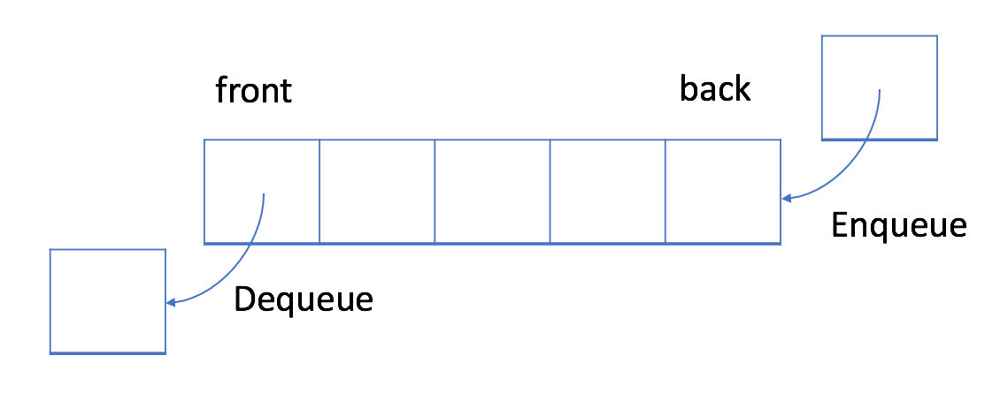

## Q1 [LeetCode 119] [Pascal's Triangle II](https://leetcode.com/problems/pascals-triangle-ii/description/)

Given a non-negative index k where k ≤ 33, return the kth index row of the Pascal's triangle.

Note that the row index starts from 0.


In Pascal's triangle, each number is the sum of the two numbers directly above it.

Example:
```
Input: 3
Output: [1,3,3,1]
```
Follow up:
* Could you optimize your algorithm to use only O(k) extra space?

## Q2 [LeetCode 151] [Reverse Words in a String](https://leetcode.com/problems/reverse-words-in-a-string)
Given an input string, reverse the string word by word.

Example:  
```
Input: "the sky is blue",
Output: "blue is sky the".
```
Note:

* A word is defined as a sequence of non-space characters.
* Input string may contain leading or trailing spaces. However, your reversed string should not contain leading or trailing spaces.
* You need to reduce multiple spaces between two words to a single space in the reversed string.

Follow up: For C programmers, try to solve it in-place in O(1) space.

## Q3 [LeetCode 557] [Reverse Words in a String III](https://leetcode.com/problems/reverse-words-in-a-string-iii/description/)
Given a string, you need to reverse the order of characters in each word within a sentence while still preserving whitespace and initial word order.

Example 1:
```
Input: "Let's take LeetCode contest"
Output: "s'teL ekat edoCteeL tsetnoc"
```
Note: In the string, each word is separated by single space and there will not be any extra space in the string.

## Q4 [LeetCode 26] [Remove Duplicates from Sorted Array](https://leetcode.com/problems/remove-duplicates-from-sorted-array/description/)
Given a sorted array nums, remove the duplicates in-place such that each element appear only once and return the new length.

Do not allocate extra space for another array, you must do this by modifying the input array in-place with O(1) extra memory.

Example 1:
```
Given nums = [1,1,2],

Your function should return length = 2, with the first two elements of nums being 1 and 2 respectively.

It doesn't matter what you leave beyond the returned length.
```
Example 2:
```
Given nums = [0,0,1,1,1,2,2,3,3,4],

Your function should return length = 5, with the first five elements of nums being modified to 0, 1, 2, 3, and 4 respectively.

It doesn't matter what values are set beyond the returned length.
```

## Q5 [LeetCode 283] [Move Zeroes](https://leetcode.com/problems/move-zeroes/description/)

Given an array `nums`, write a function to move all `0`'s to the end of it while maintaining the relative order of the non-zero elements.

Example:
```
Input: [0,1,0,3,12]
Output: [1,3,12,0,0]
```
Note:
* You must do this in-place without making a copy of the array.
* Minimize the total number of operations.

## LeetCode Queue & Stack [1/1] (Aug 15)
We may access a random element by index in Array. However, we might want to restrict the processing order in some cases.

## First-in-first-out Data Structure: Queue

In a FIFO data structure, the first element added to the queue will be processed first.



As shown in the picture above, the queue is a typical FIFO data stucture. The insert operation is also called enqueue and the new element is always added at the end of the queue. The delete operation is called dequeue. You are only allowed to remove the first element.

### BFS Templates using Queue
Previously, we have already introduced two main scenarios of using BFS: do traversal or find the shortest path. Typically, it happens in a tree or a graph. As we mentioned in the chapter description, BFS can also be used in more abstract scenarios.

```
It will be important to determine the nodes and the edges before doing BFS in a specific question. Typically, the node will be an actual node or a status while the edge will be an actual edge or a possible transition.
```

Template I:
```java
/**
 * Return the length of the shortest path between root and target node.
 */
int BFS(Node root, Node target) {
    Queue<Node> queue;  // store all nodes which are waiting to be processed
    int step = 0;       // number of steps needed from root to current node
    // initialize
    add root to queue;
    // BFS
    while (queue is not empty) {
        step = step + 1;
        // iterate the nodes which are already in the queue
        int size = queue.size();
        for (int i = 0; i < size; ++i) {
            Node cur = the first node in queue;
            return step if cur is target;
            for (Node next : the neighbors of cur) {
                add next to queue;
            }
            remove the first node from queue;
        }
    }
    return -1;          // there is no path from root to target
}
```
* As shown in the code, in each round, the nodes in the queue are the nodes which are waiting to be processed.
* After each outer while loop, we are one step farther from the root node. The variable step indicates the distance from the root node and the current node we are visiting.

Template II:

Sometimes, it is important to make sure that we never visit a node twice. Otherwise, we might get stuck in an infinite loop. If so, we can add a hash set to the code above to solve this problem. Here is the pseudocode after modification:
```java
/**
 * Return the length of the shortest path between root and target node.
 */
int BFS(Node root, Node target) {
    Queue<Node> queue;  // store all nodes which are waiting to be processed
    Set<Node> used;     // store all the used nodes
    int step = 0;       // number of steps neeeded from root to current node
    // initialize
    add root to queue;
    add root to used;
    // BFS
    while (queue is not empty) {
        step = step + 1;
        // iterate the nodes which are already in the queue
        int size = queue.size();
        for (int i = 0; i < size; ++i) {
            Node cur = the first node in queue;
            return step if cur is target;
            for (Node next : the neighbors of cur) {
                if (next is not in used) {
                    add next to queue;
                    add next to used;
                }
            }
            remove the first node from queue;
        }
    }
    return -1;          // there is no path from root to target
}
```
There are two cases you don't need the hash set used:

* You are absolutely sure there is no cycle, for example, in tree traversal;
* You do want to add the node to the queue multiple times.

### Q6 [LeetCode 286] [Walls and Gates](https://leetcode.com/problems/walls-and-gates/description/)

You are given a m x n 2D grid initialized with these three possible values.

1. -1 - A wall or an obstacle.
2. 0 - A gate.
3. INF - Infinity means an empty room. We use the value 231 - 1 = 2147483647 to represent INF as you may assume that the distance to a gate is less than 2147483647.
Fill each empty room with the distance to its nearest gate. If it is impossible to reach a gate, it should be filled with INF.

Example:
```
Given the 2D grid:

INF  -1  0  INF
INF INF INF  -1
INF  -1 INF  -1
  0  -1 INF INF
```
After running your function, the 2D grid should be:
```
  3  -1   0   1
  2   2   1  -1
  1  -1   2  -1
  0  -1   3   4
```
