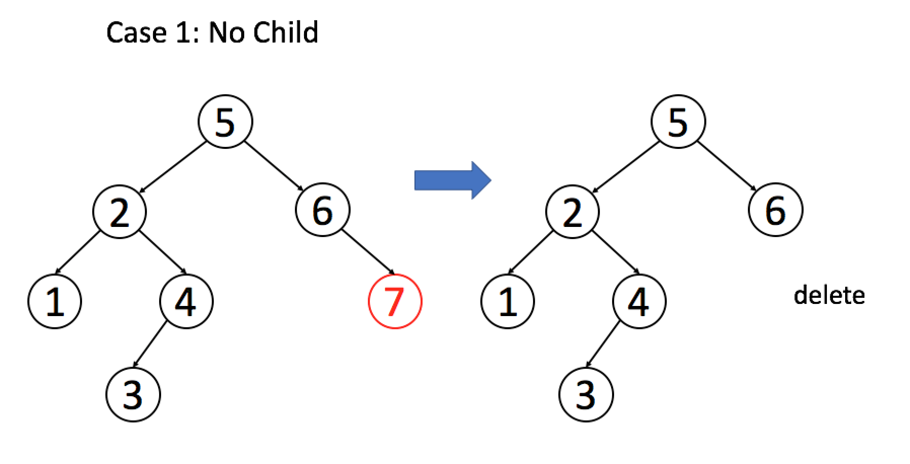

### Q1 [Leetcode 336] [Palindrome Pairs](https://leetcode.com/problems/palindrome-pairs)

Given a list of unique words, find all pairs of distinct indices (i, j) in the given list, so that the concatenation of the two words, i.e. words[i] + words[j] is a palindrome.

Example 1:
```
Input: ["abcd","dcba","lls","s","sssll"]
Output: [[0,1],[1,0],[3,2],[2,4]]
Explanation: The palindromes are ["dcbaabcd","abcddcba","slls","llssssll"]
```
Example 2:
```
Input: ["bat","tab","cat"]
Output: [[0,1],[1,0]]
Explanation: The palindromes are ["battab","tabbat"]
```

## LeetCode Binary Search Tree [1/1] (Aug 25)

A `Binary Search Tree` is a special form of a binary tree. The value in each node must be greater than (or equal to) any values in its left subtree but less than (or equal to) any values in its right subtree.

### Definition of the Binary Search Tree

A binary search tree (BST), a special form of a binary tree, satisfies the binary search property:

1. The value in each node must be greater than (or equal to) any values stored in its left subtree.
2. The value in each node must be less than (or equal to) any values stored in its right subtree.


Here is an example of a BST.


We have exercises for you to validate a BST after this article. You can use the property we mentioned above to determine whether a binary tree is a BST or not. The recursive thinking we have introduced in the previous chapter might help you with this problem.

Like a normal binary tree, we can traverse a BST in preorder, inorder, postorder or level-order. However, it is noteworthy that inorder traversal in BST will be in ascending order. Therefore, the inorder traversal is the most frequent used traversal method of a BST.

We also have exercises for you to find the inorder successor in a BST after this article. Obviously, you can do the inorder traversal to find the inorder successor in a BST. But please try to apply the property of the BST we have learned to find out a better way to solve this problem.

### Q2 [Leetcode 98] [Validate Binary Search Tree](https://leetcode.com/problems/validate-binary-search-tree)

Given a binary tree, determine if it is a valid binary search tree (BST).

Assume a BST is defined as follows:

* The left subtree of a node contains only nodes with keys less than the node's key.
* The right subtree of a node contains only nodes with keys greater than the node's key.
* Both the left and right subtrees must also be binary search trees.

Example 1:
```
Input:
    2
   / \
  1   3
Output: true
```
Example 2:
```
    5
   / \
  1   4
     / \
    3   6
Output: false
Explanation: The input is: [5,1,4,null,null,3,6]. The root node's value
             is 5 but its right child's value is 4.
```
### Q3 [Leetcode 285] [Inorder Successor in BST](https://leetcode.com/problems/inorder-successor-in-bst)

Given a binary search tree and a node in it, find the in-order successor of that node in the BST.

Note: If the given node has no in-order successor in the tree, return null.

Example 1:
```
Input: root = [2,1,3], p = 1

  2
 / \
1   3

Output: 2
```
Example 2:
```
Input: root = [5,3,6,2,4,null,null,1], p = 6

      5
     / \
    3   6
   / \
  2   4
 /   
1

Output: null
```

### Q4 [Leetcode 173] [Binary Search Tree Iterator](https://leetcode.com/problems/binary-search-tree-iterator)

Implement an iterator over a binary search tree (BST). Your iterator will be initialized with the root node of a BST.

Calling next() will return the next smallest number in the BST.

Note: next() and hasNext() should run in average O(1) time and uses O(h) memory, where h is the height of the tree.

Credits:
Special thanks to @ts for adding this problem and creating all test cases.

### Search in a BST - Introduction

BSTs support three main operations: search, insertion and deletion. In this section, we are going to talk about how to search for a specific value in a BST.

According to the property of BST, for each node:

1. return the node if the target value is equal to the value of the node;
2. continue searching in the left subtree if the target value is less than the value of the node;
3. continue searching in the right subtree if the target value is larger than the value of the node.

Let's go through an example: we search for target = 4 in the BST above.


### Insertion in the Binary Search Tree - Introduction
Another common operation in BST is to insert a new node. There are many different strategies for insertion. We only talk about a typical insertion strategy which minimizes the changes. The main idea is to find out a proper leaf position for the target node and then insert the node as a leaf. Therefore, insertion will begin as a search.

Similar to our search strategy, for each node, we will:

1. search the left or right subtrees according to the relation of the value of the node and the value of our target node;
2. repeat STEP 1 until reaching an external node;
3. add the new node as its left or right child depending on the relation of the value of the node and the value of our target node.
In this way, we add a new node and maintain the property of BST.

Similar to search, we can do insertion recursively or iteratively. The solution is so similar with search that you should be able to implement it by yourself and analyze the time complexity and space complexity in the same way.

### Q5 [Leetcode 701] [Insert into a Binary Search Tree](https://leetcode.com/problems/insert-into-a-binary-search-tree)

Given the root node of a binary search tree (BST) and a value to be inserted into the tree, insert the value into the BST. Return the root node of the BST after the insertion. It is guaranteed that the new value does not exist in the original BST.

Note that there may exist multiple valid ways for the insertion, as long as the tree remains a BST after insertion. You can return any of them.

For example,
```
Given the tree:
        4
       / \
      2   7
     / \
    1   3
And the value to insert: 5
You can return this binary search tree:

         4
       /   \
      2     7
     / \   /
    1   3 5
This tree is also valid:

         5
       /   \
      2     7
     / \   
    1   3
         \
          4
```
### Deletion in a BST - Introduction
Deletion is more complicated than the two operations we mentioned before. There are also many different strategies for deletion. We are going to introduce one of them which minimizes the changes. Our solution is to replace the target node with a proper child. According to the number of its children, we should consider three different cases:
```
1. If the target node has no child, we can simply remove the node.
2. If the target node has one child, we can use its child to replace itself.
3. If the target node has two children, replace the node with its in-order successor or predecessor node and delete that node.
```



Here are examples of different cases to help you understand this strategy.

By understanding the strategy above, you should be able to implement deletion function on your own. We have done an exercise about finding the inorder successor in a BST in the previous section. The solution for that question might help you implement the deletion function.

### Q6 [Leetcode 450] [Delete Node in a BST](https://leetcode.com/problems/delete-node-in-a-bst)

Given a root node reference of a BST and a key, delete the node with the given key in the BST. Return the root node reference (possibly updated) of the BST.

Basically, the deletion can be divided into two stages:

1. Search for a node to remove.
2. If the node is found, delete the node.

Note: Time complexity should be O(height of tree).

Example:
```
root = [5,3,6,2,4,null,7]
key = 3

    5
   / \
  3   6
 / \   \
2   4   7

Given key to delete is 3. So we find the node with value 3 and delete it.

One valid answer is [5,4,6,2,null,null,7], shown in the following BST.

    5
   / \
  4   6
 /     \
2       7

Another valid answer is [5,2,6,null,4,null,7].

    5
   / \
  2   6
   \   \
    4   7
```
