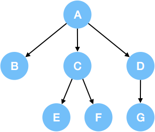

### Q1 [Leetcode 703] [Kth Largest Element in a Stream](https://leetcode.com/problems/kth-largest-element-in-a-stream)

Design a class to find the kth largest element in a stream. Note that it is the kth largest element in the sorted order, not the kth distinct element.

Your KthLargest class will have a constructor which accepts an integer k and an integer array nums, which contains initial elements from the stream. For each call to the method KthLargest.add, return the element representing the kth largest element in the stream.

Example:
```
int k = 3;
int[] arr = [4,5,8,2];
KthLargest kthLargest = new KthLargest(3, arr);
kthLargest.add(3);   // returns 4
kthLargest.add(5);   // returns 5
kthLargest.add(10);  // returns 5
kthLargest.add(9);   // returns 8
kthLargest.add(4);   // returns 8
```
Note:
You may assume that nums' length ≥ k-1 and k ≥ 1.

### Q2 [Leetcode 235] [Lowest Common Ancestor of a Binary Search Tree](https://leetcode.com/problems/lowest-common-ancestor-of-a-binary-search-tree)
Given a binary search tree (BST), find the lowest common ancestor (LCA) of two given nodes in the BST.

According to the definition of LCA on Wikipedia: “The lowest common ancestor is defined between two nodes p and q as the lowest node in T that has both p and q as descendants (where we allow a node to be a descendant of itself).”

Given binary search tree:  root = [6,2,8,0,4,7,9,null,null,3,5]
```
        _______6______
       /              \
    ___2__          ___8__
   /      \        /      \
   0      _4       7       9
         /  \
         3   5
```
Example 1:
```
Input: root = [6,2,8,0,4,7,9,null,null,3,5], p = 2, q = 8
Output: 6
Explanation: The LCA of nodes 2 and 8 is 6.
```
Example 2:
```
Input: root = [6,2,8,0,4,7,9,null,null,3,5], p = 2, q = 4
Output: 2
Explanation: The LCA of nodes 2 and 4 is 2, since a node can be a descendant of itself
             according to the LCA definition.
```
Note:

* All of the nodes' values will be unique.
* p and q are different and both values will exist in the BST.

### Q3 [Leetcode 220] [Contains Duplicate III](https://leetcode.com/problems/contains-duplicate-iii)

Given an array of integers, find out whether there are two distinct indices i and j in the array such that the absolute difference between nums[i] and nums[j] is at most t and the absolute difference between i and j is at most k.

Example 1:
```
Input: nums = [1,2,3,1], k = 3, t = 0
Output: true
```
Example 2:
```
Input: nums = [1,0,1,1], k = 1, t = 2
Output: true
```
Example 3:
```
Input: nums = [1,5,9,1,5,9], k = 2, t = 3
Output: false
```

### Q4 [Leetcode 110] [Balanced Binary Tree](https://leetcode.com/problems/balanced-binary-tree)
Given a binary tree, determine if it is height-balanced.

For this problem, a height-balanced binary tree is defined as:
```
a binary tree in which the depth of the two subtrees of every node never differ by more than 1.
```
Example 1:
```
Given the following tree [3,9,20,null,null,15,7]:

    3
   / \
  9  20
    /  \
   15   7
Return true.
```
Example 2:
```
Given the following tree [1,2,2,3,3,null,null,4,4]:

       1
      / \
     2   2
    / \
   3   3
  / \
 4   4
Return false.
```

### Q5 [Leetcode 108] [Convert Sorted Array to Binary Search Tree](https://leetcode.com/problems/convert-sorted-array-to-binary-search-tree)

Given an array where elements are sorted in ascending order, convert it to a height balanced BST.

For this problem, a height-balanced binary tree is defined as a binary tree in which the depth of the two subtrees of every node never differ by more than 1.

Example:
```
Given the sorted array: [-10,-3,0,5,9],

One possible answer is: [0,-3,9,-10,null,5], which represents the following height balanced BST:

      0
     / \
   -3   9
   /   /
 -10  5
 ```

 ## LeetCode Nary Tree [1/1] (Aug 27)

 In the previous article, we focused more on binary tree. This card extends the concept you have learned in binary tree to n-ary tree.

 ### Traversal of N-ary Tree

 A binary tree can be traversed in preorder, inorder, postorder or level-order. Among these traversal methods, preorder, postorder and level-order traversal are suitable to be extended to an N-ary tree.

 ```
 Retrospect - Traverse a Binary Tree

1. Preorder Traversal: Visit the root node, then traverse the left subtree and finally traverse the right subtree.
2. Inorder Traversal: Traverse the left subtree, then visit the root node and finally traverse the right subtree.
3. Postorder Traversal: Traverse the left subtree, then traverse the right subtree and finally visit the root node.
4. Level-order Traversal: Traverse the tree level by level.
```

Note that here is no standard definition for in-order traversal in n-ary trees. It probably only makes sense for binary trees. While there are several different possible ways that one could define in-order traversal for n-ary trees, each of those feels a bit odd and unnatural and probably not terribly useful in practice.

To generalize the above to n-ary trees, you simply replace the steps:
```
Traverse the left subtree.... Traverse the right subtree....
```
in the above by:
```
For each child:
      Traverse the subtree rooted at that child by recursively calling the traversal function
```
We assume that the for-loop will iterate through the children in the order they are found in the data-structure: typically, in left-to-right order, for a diagram such as below.

### N-ary Tree Traversal Examples
We will use the following 3-ary tree as example:



1. Preorder Traversal

  In an N-ary tree, preorder means visit the root node first and then traverse the subtree rooted at its children one by one. For instance, the preorder of the 3-ary tree above is: A->B->C->E->F->D->G.

2. Postorder Traversal

  In an N-ary tree, postorder means traverse the subtree rooted at its children first and then visit the root node itself. For instance, the postorder of the 3-ary tree above is: B->E->F->C->G->D->A.

3. Level-order Traversal

  Level-order traversal in an N-ary tree is the same with a binary tree. Typically, when we do breadth-first search in a tree, we will traverse the tree in level order. For instance, the level-order of the 3-ary tree above is: A->B->C->D->E->F->G.

### Q6 [Leetcode 589] [N-ary Tree Preorder Traversal](https://leetcode.com/problems/n-ary-tree-preorder-traversal)

Given an n-ary tree, return the preorder traversal of its nodes' values.


For example, given a 3-ary tree:


Return its preorder traversal as: [1,3,5,6,2,4].


Note: Recursive solution is trivial, could you do it iteratively?

### Q7 [Leetcode 590] [N-ary Tree Postorder Traversal](https://leetcode.com/problems/n-ary-tree-postorder-traversal)

Given an n-ary tree, return the postorder traversal of its nodes' values.


For example, given a 3-ary tree:


Return its postorder traversal as: [5,6,3,2,4,1].

Note: Recursive solution is trivial, could you do it iteratively?

### Q8 [Leetcode 429] [N-ary Tree Level Order Traversal](https://leetcode.com/problems/n-ary-tree-level-order-traversal)

Given an n-ary tree, return the level order traversal of its nodes' values. (ie, from left to right, level by level).

For example, given a 3-ary tree:


We should return its level order traversal:

```
[
     [1],
     [3,2,4],
     [5,6]
]
```
Note:

The depth of the tree is at most 1000.
The total number of nodes is at most 5000.
